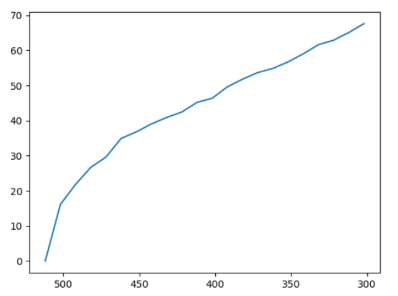

## QOS-NMF

This work is dedicated to the implementation of a non-negative matrix factorization algorithm developed in the National engineering school of Tunis called QOS NMF.
feel free to reach out for any collaboration ideas.

## data loss

this figure illustrates the amount of data loss based on the factor R of factorisation

## Execution times

this figure illustrates the difference in execution time between QOS nmf and NMF already implemented in the python library Scikit-learn

